# MIS dashboard ERD

The diagram shows the tables created by `seed.py`. Arrows point from a child
table to its referenced parent. Composite relationships are labelled with the
columns participating in the relationship.

Authentication is intentionally outside the warehouse model: fake LDAP
credential hashes live in memory, while `MIS_DIM_USER` stores the linked
persona and its reporting scope.

`MIS_CONTROL_DATASET_LOAD` is a normal control table with no business foreign
keys. It is read directly by the application cache coordinator and records
which complete ETL dataset version is published.

```mermaid
erDiagram
    MIS_DIM_REGION {
        int region_id PK
        string region_code UK
        string region_name
    }
    MIS_DIM_BRANCH {
        int branch_id PK
        string branch_code UK
        int region_id FK
    }
    MIS_DIM_ADVISOR {
        int advisor_id PK
        string advisor_code UK
        int branch_id FK
    }
    MIS_DIM_PRODUCT {
        int product_id PK
        string product_code UK
    }
    MIS_DIM_CHANNEL {
        int channel_id PK
        string channel_name UK
    }
    MIS_DIM_CAMPAIGN {
        int campaign_id PK
        string campaign_code UK
        int product_id FK
        date start_date FK
        date end_date FK
    }
    MIS_DIM_DATE {
        date calendar_date PK
    }
    MIS_DIM_ORG_ASSIGNMENT {
        int org_assignment_sk PK
        int advisor_id FK
        int branch_id FK
        int region_id FK
        date valid_from
        date valid_to
    }
    MIS_FACT_SALES {
        int sale_id PK
        date sale_date FK
        int branch_id FK
        int advisor_id FK
        int product_id FK
        int channel_id FK
    }
    MIS_FACT_BALANCES {
        date balance_month PK, FK
        int branch_id PK, FK
        int product_id PK, FK
    }
    MIS_FACT_CUSTOMER_MOVEMENT {
        date movement_month PK, FK
        int branch_id PK, FK
    }
    MIS_FACT_CAMPAIGN_RESULTS {
        int campaign_id PK, FK
        int branch_id PK, FK
    }
    MIS_FACT_BRANCH_PLAN {
        int branch_id PK, FK
        date plan_month PK, FK
    }
    MIS_FACT_ADVISOR_PERF {
        int advisor_id PK, FK
        date perf_month PK, FK
    }
    MIS_DIM_USER {
        int user_id PK
        string user_code UK
        int advisor_id FK
        int branch_id FK
        int region_id FK
    }
    MIS_FACT_PERFORMANCE_SNAPSHOT {
        date snapshot_date PK, FK
        int advisor_id PK, FK
        int historical_branch_id PK, FK
        int historical_region_id FK
        date month_start FK
    }
    MIS_AUDIT_SNAPSHOT_LOAD {
        string load_id UK
        date snapshot_date PK, FK
        date source_max_date FK
    }
    MIS_CONTROL_DATASET_LOAD {
        string dataset_name PK
        bigint version_no PK
        string load_id UK
        date source_max_date
        string published_at
        string status
    }

    MIS_DIM_REGION ||--o{ MIS_DIM_BRANCH : contains
    MIS_DIM_BRANCH ||--o{ MIS_DIM_ADVISOR : employs
    MIS_DIM_PRODUCT ||--o{ MIS_DIM_CAMPAIGN : promotes
    MIS_DIM_DATE ||--o{ MIS_DIM_CAMPAIGN : dates

    MIS_DIM_ADVISOR ||--o{ MIS_DIM_ORG_ASSIGNMENT : history
    MIS_DIM_BRANCH ||--o{ MIS_DIM_ORG_ASSIGNMENT : history
    MIS_DIM_REGION ||--o{ MIS_DIM_ORG_ASSIGNMENT : history

    MIS_DIM_BRANCH ||--o{ MIS_FACT_SALES : records
    MIS_DIM_ADVISOR ||--o{ MIS_FACT_SALES : records
    MIS_DIM_PRODUCT ||--o{ MIS_FACT_SALES : sold
    MIS_DIM_CHANNEL ||--o{ MIS_FACT_SALES : uses
    MIS_DIM_DATE ||--o{ MIS_FACT_SALES : dates

    MIS_DIM_BRANCH ||--o{ MIS_FACT_BALANCES : measured
    MIS_DIM_PRODUCT ||--o{ MIS_FACT_BALANCES : measured
    MIS_DIM_DATE ||--o{ MIS_FACT_BALANCES : dates
    MIS_DIM_BRANCH ||--o{ MIS_FACT_CUSTOMER_MOVEMENT : measured
    MIS_DIM_DATE ||--o{ MIS_FACT_CUSTOMER_MOVEMENT : dates
    MIS_DIM_CAMPAIGN ||--o{ MIS_FACT_CAMPAIGN_RESULTS : measures
    MIS_DIM_BRANCH ||--o{ MIS_FACT_CAMPAIGN_RESULTS : measures
    MIS_DIM_BRANCH ||--o{ MIS_FACT_BRANCH_PLAN : plans
    MIS_DIM_DATE ||--o{ MIS_FACT_BRANCH_PLAN : dates
    MIS_DIM_ADVISOR ||--o{ MIS_FACT_ADVISOR_PERF : scores
    MIS_DIM_DATE ||--o{ MIS_FACT_ADVISOR_PERF : dates

    MIS_DIM_ADVISOR o|--o{ MIS_DIM_USER : scopes
    MIS_DIM_BRANCH o|--o{ MIS_DIM_USER : scopes
    MIS_DIM_REGION o|--o{ MIS_DIM_USER : scopes

    MIS_DIM_DATE ||--o{ MIS_FACT_PERFORMANCE_SNAPSHOT : snapshot
    MIS_DIM_ADVISOR ||--o{ MIS_FACT_PERFORMANCE_SNAPSHOT : scores
    MIS_DIM_BRANCH ||--o{ MIS_FACT_PERFORMANCE_SNAPSHOT : historical_branch
    MIS_DIM_REGION ||--o{ MIS_FACT_PERFORMANCE_SNAPSHOT : historical_region
    MIS_FACT_ADVISOR_PERF ||--o{ MIS_FACT_PERFORMANCE_SNAPSHOT : month_score
    MIS_DIM_DATE ||--o{ MIS_AUDIT_SNAPSHOT_LOAD : audited_snapshot
```

## Grain and key notes

- `MIS_DIM_ORG_ASSIGNMENT` uses a surrogate PK because one advisor has several
  historical versions. The unique pair (`advisor_id`, `valid_from`) prevents
  two versions from starting on the same date.
- The performance snapshot uses (`snapshot_date`, `advisor_id`,
  `historical_branch_id`) because an advisor may have activity in two historical
  branches during a month containing a transfer.
- Fact-table composite PKs reflect the natural reporting grain rather than a
  synthetic row number.
- `MIS_DIM_USER` scope keys are nullable by design: an analyst has no single
  advisor, branch or region scope.
